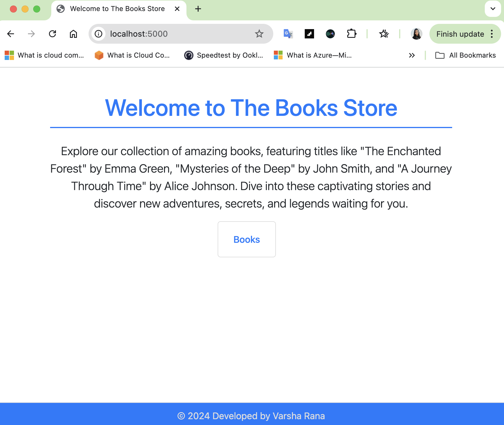
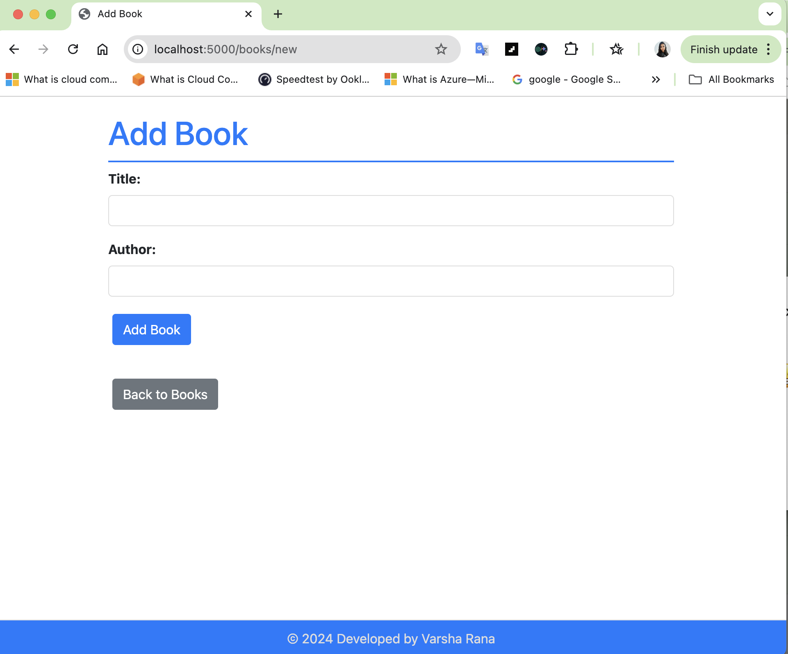
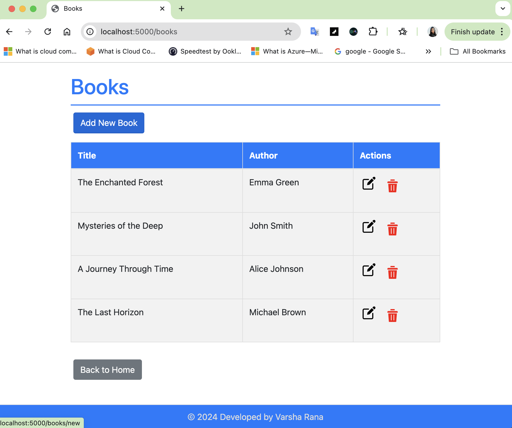

# Full-Flask-RESTful-API-Project 

## Project Description

The **Full-Flask-RESTful-API-Project** is a comprehensive Flask-based web application that serves as a RESTful API for managing a collection of books. It features API routes for creating, retrieving, updating, and deleting books, along with a web interface that uses HTML templates for displaying book data. The application also includes custom error handling, static files for styling and interactivity, and iconography for enhanced user experience.

### Features

- **RESTful API**: Full CRUD (Create, Read, Update, Delete) operations on books via API endpoints.
- **Homepage**: Displays a list of books with options to add, edit, or delete entries.
- **Book Management**: Web interface for managing books in the collection.
- **Error Handling**: Custom error pages for various HTTP status codes.
- **Static Files**: Includes custom CSS, JavaScript, icons, and images for a polished front-end experience.
- **Icons and Images**: Pre-designed icons for edit and delete actions, plus sample images.

## Installation

### Prerequisites

- Python 3.x
- Flask

### Setup

1. **Clone the repository:**
   ```sh
   git clone https://github.com/Vrana710/Full-Flask-RESTful-API-Project.git
   ```
2. **Navigate into the project directory:**
   ```sh
   cd Full-Flask-RESTful-API-Project
   ```
3. **Create a virtual environment:**
   ```sh
   python3 -m venv venv
   ```
4. **Activate the virtual environment:**
   - On macOS/Linux:
     ```sh
     source venv/bin/activate
     ```
   - On Windows:
     ```sh
     venv\Scripts\activate
     ```
5. **Install the required dependencies:**
   ```sh
   pip3 install -r requirements.txt
   ```

### Running the Application

1. **Ensure the virtual environment is activated.**
2. **Run the Flask application:**
   ```sh
   python3 run.py
   ```
3. **Open your web browser and navigate to** `http://127.0.0.1:5000/` **or** `http://localhost:5000/` **to view the application.**

### Preview







## File Descriptions

- **`app/__init__.py`**: Sets up the Flask application, including blueprint registration and configurations.
- **`app/main.py`**: Contains the main API routes and view functions for book management.
- **`app/models.py`**: Defines the database schema and models, such as the Book model.
- **`app/config.py`**: Configuration settings for the application, including database URLs and environment variables.
- **`app/utils.py`**: Utility functions and helpers that support various functionalities in the application.
- **`app/templates/`**: Directory containing Jinja2 HTML templates for rendering the web pages.
- **`app/static/`**: Directory for static assets like CSS, JavaScript, icons, and images.
- **`requirements.txt`**: Lists all Python packages and dependencies required to run the application.
- **`run.py`**: The entry point script for running the Flask development server.

## API Endpoints

Here are some key API endpoints available in this project:

- **GET /api/books**: Retrieve a list of all books.
- **GET /api/books/<id>**: Retrieve details of a specific book by its ID.
- **POST /api/books**: Add a new book to the collection.
- **PUT /api/books/<id>**: Update the details of an existing book by its ID.
- **DELETE /api/books/<id>**: Delete a book from the collection by its ID.

## Contributing

If you'd like to contribute to this project, feel free to fork the repository, make changes, and submit a pull request. Issues and feature requests are also welcome!

## License

This project is licensed under the MIT License.

## Contact

If you have any questions or suggestions, feel free to contact me at [ranavarsha710@gmail.com](mailto:ranavarsha710@gmail.com).